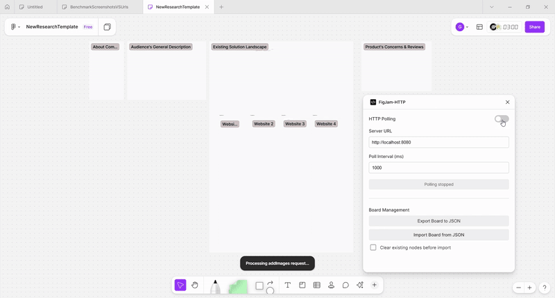

### nodePoller

A minimalistic plugin to add content on FigHam boards.  

### The plugin in action:



### Supported Objects
These objects when polled are added under the exitsing text nodes:  
```python

# creates a sticker
class StickerRequest(BaseModel):
    topicTitle: str
    content: str

    type: str = "addSticker"

# creates a vertical column sticker
class ColumnOfStickersRequest(BaseModel):
    topicTitle: str
    content: List[str]
    spacing: Optional[int] = 200

    type: str = "addStickerColumn"

# creates a vertical column of images
class ImagesRequest(BaseModel):
    topicTitle: str
    content: List[str] # list of b64 ims. but raw bytes will more efficient
    spacing: Optional[int] = 220

    type: str = "addImages"

# creates a table
class TableRequest(BaseModel):
    topicTitle: str
    content: List[Dict[str, str]]

    type: str = "addTable"
```

And these when polled will be created by coordinates:  

```python
class SectionRequest(BaseModel):
    topicTitle: Optional[str] = None
    center: Optional[Tuple[float, float]] = None
    
    width: float = 1280
    height: float = 720

    type: str = 'addSection'

class TitleRequest(BaseModel):
    topicTitle: str
    location: Tuple[float, float]
    size: int
    font: str
    color: Tuple[int, int, int]

    type: str = 'addTitle'

```


### Build and run  
```bash
npm install
npm run build
```

Then in FigJam -> Plugins -> Import Plugin from manifest -> Select the manifest.json **from the dist/ folder**